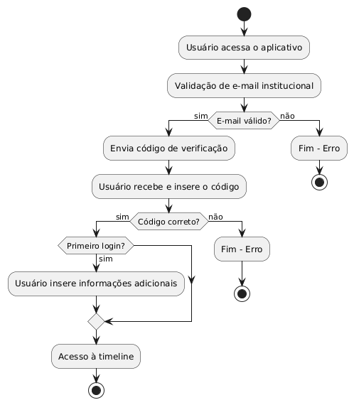
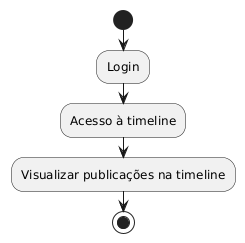
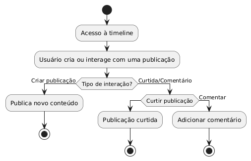
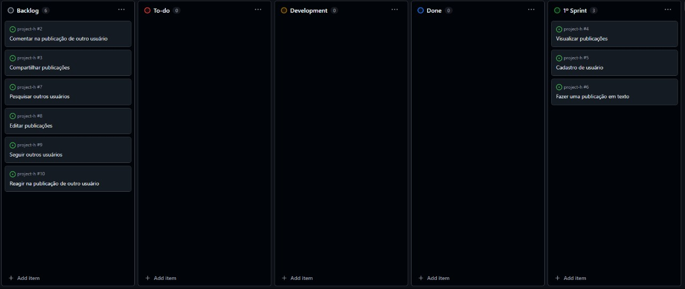

# Project H

Este projeto consiste em uma rede social acadêmica que permite a interação entre alunos e colaboradores da universidade. Inspirado em plataformas como Twitter, Bluesky e Threads, o foco principal é promover um ambiente de compartilhamento de projetos, eventos, e ações acadêmicas. O objetivo é criar uma ferramenta colaborativa e comunicativa para estudantes dos cursos de TI e Design.

## Tecnologias Utilizadas

### Front-end
- **Next.js 15**: Framework de React para desenvolvimento de aplicações web com renderização híbrida (SSR/SSG).
- **Tailwind CSS**: Framework de CSS utilitário para estilização rápida e responsiva.
- **pnpm**: Gerenciador de pacotes rápido e eficiente para instalar as dependências do front-end.

### Back-end
- **Bun**: Runtime JavaScript rápido, usado para rodar o backend.
- **Fastify**: Framework web para Node.js focado em performance e simplicidade.

## Estrutura do Projeto

- `frontend/`: Contém o código fonte do front-end.
- `backend/`: Contém o código fonte do back-end.

## Pré-requisitos

- **Node.js**: v16 ou superior (recomendado).
- **Bun**: Para rodar o back-end.
- **pnpm**: Para gerenciar dependências do front-end.
- **Docker**: Para rodar o banco de dados em um container.

## Instalação e Configuração

### Clonando o Repositório

```bash
# Clone este repositório
git clone https://github.com/seu-usuario/seu-repositorio.git

# Navegue até o diretório do projeto
cd seu-repositorio
```

### Configuração do Front-end

1. Navegue até o diretório do `frontend`:
   ```bash
   cd frontend
   ```
2. Instale as dependências usando **pnpm**:
   ```bash
   pnpm install
   ```
3. Execute o ambiente de desenvolvimento:
   ```bash
   pnpm dev
   ```
4. O front-end estará disponível em `http://localhost:3000`.

### Configuração do Back-end

1. Navegue até o diretório do `backend`:
   ```bash
   cd backend
   ```
2. Instale as dependências usando **bun**:
   ```bash
   bun install
   ```
3. Suba o container com o banco de dados:
   ```bash
   docker compose up -d
   ```
4. Execute as migrations para criar as tabelas no banco de dados:
   ```bash
   bun db:generate && bun db:migrate
   ```
5. Execute o servidor do back-end:
   ```bash
   bun run dev
   ```
6. O back-end estará disponível em `http://localhost:8080`.

## Scripts Disponíveis

### Front-end

- `pnpm dev`: Inicia o servidor de desenvolvimento do Next.js.
- `pnpm build`: Cria a build de produção do projeto.
- `pnpm start`: Inicia o servidor com a build de produção.

### Back-end

- `bun dev`: Inicia o servidor de desenvolvimento com Fastify.
- `bun start`: Inicia o servidor em modo de produção.

## Funcionalidades Principais
- **Cadastro e autenticação de usuários** com verificação de e-mail institucional.
- **Publicação de conteúdos** (posts) que podem incluir textos, links, e imagens.
- **Interação entre usuários**, incluindo curtidas e comentários em posts.
- **Sistema de seguidores**, permitindo que usuários acompanhem atualizações uns dos outros.

## Diagrama de atividades











## Backlog



## Colaboradores

[Douglas Araújo](https://github.com/araujodgdev)
<br/>
[Isabela Karla](https://github.com/isabelakarla)
<br/>
[Luis Facunde](https://github.com/LuisFacunde)
<br/>
[Dayanne Moraes](https://github.com/DayanneMoraes)
<br/>
[Lucas Alves](https://github.com/Lucas-Alves123)
<br/>
[Gabriel Farias](https://github.com/gabrielfariaxs)
<br/>
[Ewerton Monteiro](https://github.com/ewertonmonteiroo)

